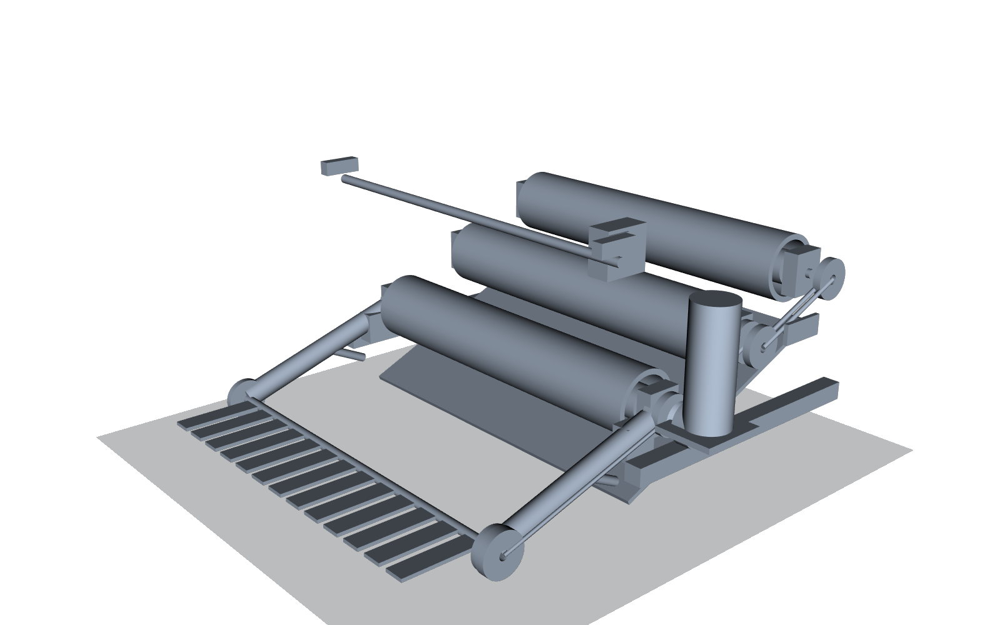

# FTC 2026–2027 BIOBUZZ 机器人工程

本仓库用于从需求到制造发布的模块化、参数化、可追溯 FTC 机器人开发。这里保存可复算的计算、参数化 CAD、验证产物和工程文档；[Linear](https://linear.app/keithschoolrobotic/project/ftc-2026-biobuzz-c4695fa110f5) 管理工作，[Notion](https://app.notion.com/p/3e27fc7bbcfb81159c11c41464b523fc) 保存耐久知识。

## 当前权威状态

- Requirements v0.1 与 Architecture v0.1 已批准；详细恢复点以 [`PROJECT_STATUS.md`](PROJECT_STATUS.md) 为准。
- 当前系统架构把比赛物体获取定义为 **T04**，T02 是主承力结构；这是本仓库后续工作的权威编号。
- T04 当前主原型是 C04-B1：25° 楔形直线侧拨、17 mm 卷线鼓和 REV-41-3336 舵机的 M3 可打印验证件；下一步是实体打印、装配、测力、电流、滑移和循环测试。
- P3 HIVE 主分支仍在 M1；C06-B 对置双飞轮为主台架概念，尚未冻结最终发射机构。
- 本次并入的 `cad/` 平铺目录还包括早期/独立的 Intake、Transfer、Feeder、Launcher CAD 基线。这些是参考和验证资产，不自动取代 `cad/modules/`、`config/parameters.yaml`、系统架构或已记录决策。

## 单电机翻转 Intake 参考基线

`cad/biobuzz_single_motor_flipout_intake.py` 是从 [Robot in 30 Hours BIOBUZZ reveal](https://youtu.be/RIt5xxJ2Yxs) 可见结构出发建立的参数化参考：竖直电机、90° 齿轮转向、单侧传动、多个横向 roller，以及可翻出的柔性指轴。视频没有公开齿数、尺寸、材料或部署结构，因此以下同心翻臂、弹簧部署、硬止挡和锁扣是本项目适配，不是对原机器人隐藏结构的断言。

当前参考参数：

- 一个 goBILDA `5203-2402-0019` 312 rpm 直流减速电机驱动全部 Intake roller；
- 两只 goBILDA `2320-4008-0024` 24T MOD1 斜齿轮构成 1:1 换向；
- 三根 Ø60 × 318 mm 固定 roller；两段 14T、38 节、8 mm pitch 钢链的轴距各为 `CALCULATED` 96.000 mm；
- 330 mm 净捕获宽度，`CALCULATED` 179.887 mm 同心翻臂中心距；
- goBILDA 16T:24T 带轮和 460 mm HTD5 同步带驱动 13 指前轴；
- `CALCULATED_FROM_VENDOR_SPEC` 固定 roller 表面速度约 0.98 m/s，指尖速度约 1.59 m/s；
- 双弹簧展开、双棘爪锁定、REV `REV-41-3334` 只解锁、双硬止挡承载；赛前手动收纳，当前无主动收回；
- CAD 展开包络约 452 × 444 × 225 mm，收起约 321 × 444 × 269 mm。

完整依据、BOM、风险和验收矩阵见 [`docs/engineering/t02-single-motor-flipout-intake-baseline.md`](docs/engineering/t02-single-motor-flipout-intake-baseline.md)。外部跟踪仍保留原编号 [Linear KEI-16](https://linear.app/keithschoolrobotic/issue/KEI-16/t02-single-motor-flip-out-intake-baseline-and-prototype-validation) 和 [Notion 设计页](https://app.notion.com/p/3e57fc7bbcfb812aa3c1c54a0067e17f)；二者必须注明这是导入参考基线，当前仓库权威 Intake 编号为 T04。



## 目录

```text
/
├── AGENTS.md                  # 协作、Linear/Notion 同步与工程规则
├── README.md                  # 项目入口和 AI 接手说明
├── PROJECT_STATUS.md          # 当前检查点与唯一 NEXT ACTION
├── docs/                      # 需求、架构、接口、验证、决策和工程记录
├── config/parameters.yaml     # 全局工程参数主源
├── cad/modules/               # 当前架构下可独立生成的模块 CAD
├── cad/*.py                   # 并入的参考/早期参数化 CAD 脚本
├── cad/output/                # 参考 CAD 的 STEP/STL/GLB/PNG/JSON 产物
├── calculations/              # 可复算工程计算
├── tests/                     # 参数、计算和集成检查
├── references/                # 已核验规则/供应商资料索引
└── exports/{step,stl,drawings}/ # 经清单批准的制造与交换输出
```

## 生成翻转 Intake CAD

```powershell
python -m venv .venv-cad
.\.venv-cad\Scripts\python.exe -m pip install -r .\cad\requirements.txt
.\.venv-cad\Scripts\python.exe .\cad\biobuzz_single_motor_flipout_intake.py
.\.venv-cad\Scripts\python.exe .\cad\render_biobuzz_intake.py
```

## 给下一位 AI 的详细接手说明

你正在继续 FTC 2026–2027 BIOBUZZ 长期机器人项目。不要只从最近新增的 CAD 判断项目方向；先建立权威上下文，再行动。

### 给未来的我：可直接执行的启动提示

> 你接手的是一个仍处在分阶段验证中的 FTC BIOBUZZ 工程仓库，不是已经冻结的整机方案。先在仓库根目录运行 `git status --short --branch` 和 `git pull --ff-only origin main`，然后依次完整阅读 `AGENTS.md`、`README.md`、`PROJECT_STATUS.md`、`docs/requirements.md`、`docs/system_architecture.md`、`docs/module_interfaces.md`、`docs/decision_log.md` 与 `docs/validation_plan.md`。接着搜索 Linear 项目 `FTC 2026 biobuzz` 和 Notion 项目 `FTC Robot Project` 中与当前模块相关的既有记录；更新原记录，不创建重复项。默认从 `PROJECT_STATUS.md` 的 `NEXT ACTION` 恢复，除非用户给出更新、更具体的任务。任何 CAD、计算或视频推断都必须按 `KNOWN / ASSUMED / CALCULATED / SIMULATED / MEASURED / TBD` 标记。修改后运行相称测试，更新项目状态、Linear 与 Notion，提交并推送 GitHub；在实体测试没有关闭验收条件前，不得把机构称为最终设计或 Done。

数据权威顺序：

1. 最新官方比赛规则、Team Updates、供应商图纸和实物测量；
2. `docs/requirements.md`、`docs/system_architecture.md`、`docs/module_interfaces.md`、`config/parameters.yaml`；
3. 已记录并有证据的 `docs/decision_log.md` 与 Notion 决策/测试记录；
4. 可复算脚本、测试结果和当前模块 CAD；
5. `PROJECT_STATUS.md` 只负责恢复点，README 只负责导航；二者不能暗中成为尺寸或需求的第二数据源。

开始新工作前至少运行：

```powershell
git status --short --branch
git pull --ff-only origin main
python -m unittest discover -s tests -v
```

若需要重新生成导入的翻转 Intake，再使用后文的 CadQuery 环境命令。不要提交 `.venv-cad`、缓存、密码、令牌或临时视频文件。

### 第一次打开仓库时

1. 完整阅读 `AGENTS.md`、本 README、`PROJECT_STATUS.md`。
2. 阅读 `docs/requirements.md`、`docs/system_architecture.md`、`docs/module_interfaces.md`、`docs/decision_log.md` 和 `docs/validation_plan.md`。
3. 检查 `git status` 与最近提交；不要覆盖用户的未提交更改。
4. 在 Linear 的 `FTC 2026 biobuzz` 项目中搜索当前模块问题，在 Notion 的 `FTC Robot Project` 中搜索相关约束、决策、测试、失败和 superseded 记录。
5. 只从 `PROJECT_STATUS.md` 的 `NEXT ACTION` 恢复；若它与更新的实测证据冲突，先记录修订理由和取代关系。

### 必须理解的编号与来源差异

- 当前 GitHub Architecture v0.1：T01 驱动，T02 主结构，T03 电气/控制安装，T04 获取，T05 输送/缓存/路由，T06 HIVE 发射，T07 FLOWER 处理，T08 控制/自主，T10 集成。
- Linear `KEI-16` 与对应 Notion 页面沿用了另一套“T02 Intake”编号。它们现在是**导入的单电机翻转 Intake 参考基线**，不得据此把当前 T02 主结构改名，也不得无证据取代 T04 C04-B1。
- `cad/modules/` 与 `config/parameters.yaml` 属于当前长期架构；平铺的 `cad/*.py` 和 `cad/output/` 保存另一条设计探索中的可复用几何与产物。引用时要写清来源、成熟度和是否已被当前决策采用。

### 当前最重要工作

用户当前明确把单电机传动和翻转放出列为最高优先级。权威 `NEXT ACTION` 是制作 KEI-16 单侧全传动＋单摆臂锁扣台架：先核对/采购已列 goBILDA 与 REV 零件，测轴向堆叠、0.8 ±0.1 N·m 打滑、弹簧力曲线、3.4 A / 200 ms 堵转保护和 200 次释放。T04-C04B1-M3-0.3 的打印验证件仍保留，但在本轮用户优先级完成前不是恢复入口。测试前不得进入最终制造 CAD。

单电机翻转 Intake 的 COTS 传动已经计算并写入参数化 CAD，但仍要用实物关闭供应商图纸轴向堆叠、链条张紧、打滑器、弹簧和锁扣公差；先做单侧传动台架，再做全宽样机。它是否进入当前 T04 分支，必须经过与 C04-B1 的接口/资源/性能比较和明确决策，不能仅凭 STEP 文件存在而采用。

### 事实纪律与结束条件

- 对每个关键结论使用 `KNOWN`、`ASSUMED`、`CALCULATED`、`SIMULATED`、`MEASURED` 或 `TBD`。
- CAD 是待验证假设，不是实物性能证明；视频可见结构与项目推断必须分开写。
- 未完成测试、分析和必要重设计前，不得把任何子系统标成 Done。
- 完成有意义的工作后：更新本地状态/决策/接口文档，更新或创建正确的 Linear 问题，把耐久结论写入 Notion，运行相称验证，提交并推送 GitHub。
- 停止并请求实物数据的条件：关键接口尺寸、所购零件型号、真实载荷或规则解释会改变方案选择，而仓库、Linear 和 Notion 均没有可靠证据。

## 规则与制造提醒

当前规则基线和供应商资料可能在赛季中更新。制造、检查或冻结接口前，重新核对最新 Competition Manual、Team Updates、实物球和官方场地/零件 CAD。任何 `TBD` 不得以未记录的临时数值替代。
