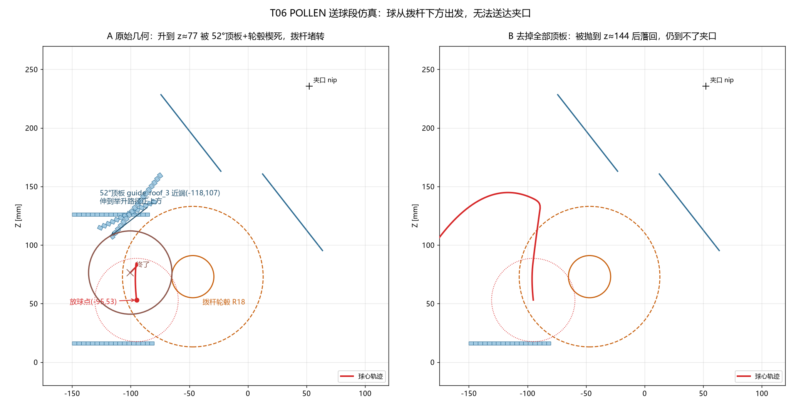

# POLLEN 发射器 MuJoCo 运动仿真 — 阶段结论

日期：2026-10-03 　模型：`cad/output/paddle_launcher_motion_free_fingers_pollen.step`
事实标签：几何 = MEASURED（直接量最终 STEP）／仿真结果 = SIMULATED／球质量 = ASSUMED

## 一、结论一句话

两飞轮对置发射段成立；**但拨杆送球段在当前几何下不成立** ——
球放在拨杆下方后，最远只能升到球心 z≈77–95 mm，就被 **52° 顶板(guide_roof_3)近端 + 拨杆轮毂** 夹死，
拨杆 qvel→0（舵机堵转），始终到不了夹口（喉道）。12 + 16 组参数全失败。

## 二、发射段：成立（SIMULATED）

球以 ≥1.44 m/s 沿 52° 进入夹口即被发射，出射 ≈0.75×轮缘线速度，方向 49–53°。
810 / 1620 / 2430 rpm → 3.6 / 6.5 / 8.5 m/s，射程 1.3 / 4.3 / 7.6 m。
（依据 `out/launch_summary.json`、`out/trace_launch_*.json`）

## 三、送球段：不成立（SIMULATED + MEASURED 几何）

球按用户要求直接放在拨杆下方（0° 托板顶面 z=17.5，球心 z=53.06）：

| 拨杆转向 | 结果 | s_max | 到达夹口? |
|---|---|---|---|
| ω_y>0（前视逆时针） | 叶片把球沿轮毂左侧托起，升到球心 z≈85–97 后楔死；拨杆 qvel→0 | −190…−210 mm | 否 |
| ω_y<0 | 叶片从上方压下，把球沿托板往左挤出（x: −95→−143） | −224…−231 mm | 否 |

（`out/under_paddle_test.json`、`out/roof3_ab.json`；判据：喉道入口 s>−20 mm）

去掉 52° 顶板 → 只升到 z≈95 仍卡；去掉**全部**顶板 → 球被抛到 z≈144 后甩飞落回，仍到不了夹口。
（`out/open_top_test.json`）

## 四、根因：三条从最终 STEP 量到的硬事实

直接在 `paddle_launcher_motion_free_fingers_pollen.step` 的 40 个实体中量取：

1. **52° 顶板（实体 #9）** bbox `x = −118.43…−72.97, z = 106.91…163.92`。
   它是把 52° 地板线各自单独沿法向偏 **110 mm** 生成的，所以近端一直伸到 x≈−118 —— 正压在
   小球绕轮毂上升的轨迹上。球心只升到 z≈77 就撞上它。
2. **26° 顶板（实体 #5）** bbox `x = −128.88…−78.13, z = 113.52…140.33`；
   与 0° 顶板（实体 #1，`z=124.5…127.5`）在 x≈−100 处实际重叠约 0.5 mm。
   → 顶板不是一条连续的通道上盖，而是"每段各自偏置"后互相打架的板。
3. **地板被拨杆鼓挖空**：0° 地板只剩到 x=−80（实体 #0），
   26° 地板只剩 `x=−80.66…−75.21`、`z=14.65…18.42`（实体 #4，1.197 cm³），
   52° 地板只剩 `x=11.68…13.71`（实体 #8，0.234 cm³）。
   → 26°/52° 段球没有地板可走，只能被叶片托着走。

再加一条纯几何判据（CALCULATED）：
球心到拨杆轴必须 ≥ 轮毂18 + 球半径35.56 = **53.56 mm**；
而 0° 顶板下沿 z=124.5 只在轴上 51.5 mm。
把这两个约束一起看，球心在 x≤−83.3 的区域最高只能到 z=88.94，
该高度上离轴又只有 39.6 mm —— **球根本塞不进轮毂与 0° 顶板之间**，绕不过去。
唯一合法放球点：0° 托板上球心 x ≤ −96.7。

## 五、可选处理方向（待用户决定）

- **A. 改 CAD 让开路径**：52° 顶板近端沿通道方向截短（约 60 mm，等于基本删掉近段）或整体抬高/外移；
  同时把顶板改成按折线做**斜接偏置**，而不是每段各自平移 110 mm。改完重跑本节全部用例。
- **B. 保留 CAD，只验证发射能力**：球直接放到 52° 导槽近夹口，跑完整"入夹口→发射→飞出"全流程并出动画。
  （发射段本来就成立，这条能立刻给出可交付结论。）
- **C. 换喂球方案**：例如把球改成从鼓的正上方投放、或在鼓内加带叶片的托板。
